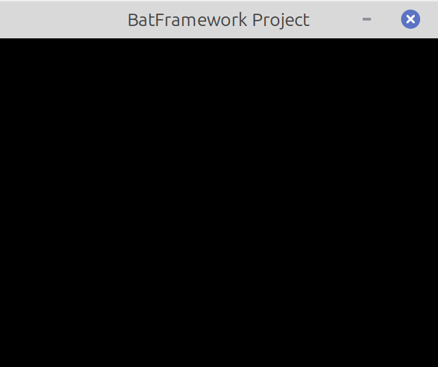
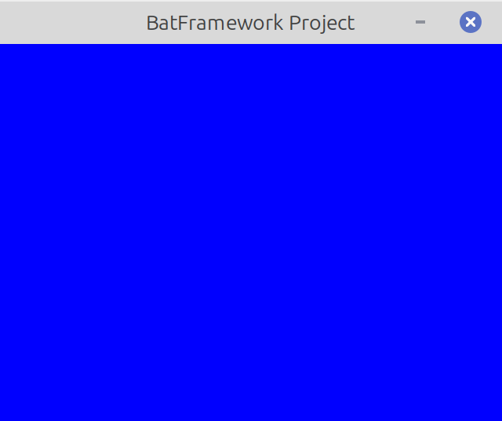

# Introduction

## Getting Started

BatFramework is available on Windows/Linux and only requires the pygame-ce library as a direct dependency.

### What you'll need

- Pygame-ce (install latest version using pip install):

- Python >=3.11


:::tip Quick Install
The following command will install batFramework and pygame-ce.
```bash
pip install --upgrade --pre batFramework
```
:::

## Your first project

### Project structure


A batFramework game is organized in the following way:

- **Manager** handles the game and its scenes
- **Scenes**  handles the entities/objects
- **Entities** are the building block of the game

When you want to add specialized behavior, you should inherit
the relevant class from the framework and override the necessary functions
to specialize it according to your needs.


### Get a window running

Here's the minimum you need to run a batFramework project.
The following code will create an empty window with the right resolution.

```python

import batFramework as bf

bf.init((640,480))

bf.Manager(bf.Scene("main")).run()

```


### Have a Scene

By inheriting a scene, you can modify access its methods, override them and customize it.
As an example, let's change the scene's background.

```python

import batFramework as bf

class MainScene(bf.Scene):
	def do_when_added(self)->None:
		self.set_clear_color("blue")

bf.init((640,480))

bf.Manager(MainScene("main")).run()

```


:::note 
You can check the Scene class to learn all the different methods the framework gives you. 
:::
